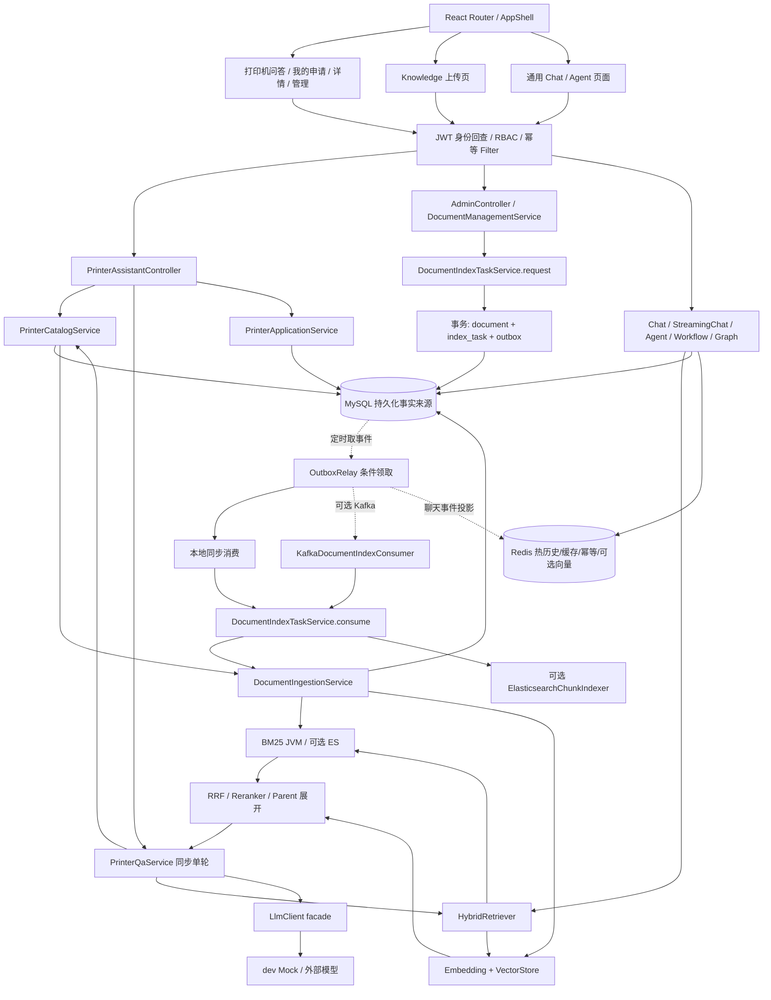

# 当前状态审计与开发交接

审计时间：2026-09-17，Asia/Hong_Kong。项目：RAG 打印机售后助手。仓库：`https://github.com/zzjj98754-hub/rag-agent-platform`；不涉及 TIM。

## 1. 审计基线与范围

- 分支：`codex/rag-platform-completion`；起点 commit：`483d5824509ab139ae4fb3c8b7324c5ba4d2c0e5`（`docs: update README for indexing and graph features`）。最近历史还包含依赖升级、Compose/CI 配置修复。
- 起点工作区：40 个已跟踪文件修改，另有未跟踪的打印机业务、索引任务、Graph、评估及学习资料等。索引区原先为空；业务成果尚未提交。不能根据起点 README 宣称这些未提交实现已发布。
- 保存范围：`src/main`/`src/test` 中当前业务及关联平台实现、前端业务和文档上传页面、pom、演示配置/Compose、README、HANDOFF、本报告。打印机代码依赖工作区已有的文档版本/块持久化、HybridRetriever 和索引基础，不能仅上传 printer 目录。
- 保留而不纳入本次提交：`AGENTS.md` 的用户改动、Dockerfile 删除 syntax 指令的改动、`TASK_PROGRESS.md`、`docs/architecture/`、`docs/learning/`、学习/简历文档、原有 known-limitations/production-acceptance-report 修改。没有回滚、清理或覆盖。
- 本次审计没有修改业务逻辑，也未增加测试框架。验证产生本地虚构申请、两个 USER 测试账号和一份审计上传文档；不提交数据库、账号哈希、日志、Token 或构建产物。
- 证据分类：**已复现**来自本轮实际命令/HTTP/SQL；**代码风险**来自明确调用或 SQL；**未验证假设**必须补运行实验。旧 HANDOFF 验证记录是历史资料，不替代本轮结果。

## 2. 面向用户的业务现状

面向使用虚构打印机的演示用户及售后管理员：选择型号、查阅适用资料、登记未解决的问题、查看人工处理状态。这是个人演示，不代表真实厂商。产品和手册是演示数据；MySQL 申请、认证、索引和检索是真实实现；默认模型输出是模拟实现。

| 用户步骤 | 页面 → API → 服务/数据 | 当前完成度及证据 |
|---|---|---|
| 登录 | Login → POST `/auth/login` → AuthenticationService/JwtService → user | 实际登录通过；BCrypt 校验，JWT 每请求回查数据库身份/角色 |
| 选型号 | PrinterAssistant → GET `/printer-assistant/products` → Catalog.listProducts → printer_product | 2 型号真实查询；页面自动选第一项，不是强制用户手动选择 |
| 初始化资料 | AdminApplications → POST `/printer-assistant/admin/initialize` → Catalog.initializeDemoData → Ingestion.ingestOne | classpath 6 份 Markdown，复用切分和索引；重复初始化后仍是 2 产品、6 关联；会推进文档版本 |
| 上传资料 | Knowledge → POST `/admin/documents/upload/async` → Management.uploadAsync → IndexTask.request → MySQL/Outbox | 新上传实测到 SUCCEEDED、1 个块；正文丢失问题见 P0-01。没有上传时选择型号或维护关联的 API/UI |
| 型号问答 | PrinterAssistant → POST `/printer-assistant/qa` → Qa.ask → Catalog.requireScope → HybridRetriever → LlmClient | 两型号同问引用各自资料；是同步、无状态单轮 JSON；未调用通用 Chat 的会话、缓存、SSE、引用后处理 |
| 引用原文 | QA 返回 Citation → Collapse 展示 snippet | snippet 来自检索 effectiveText（可能为父块全文），不是前端写死；没有版本字段或不可变原文快照，也没有校验生成答案中引用编号 |
| 无依据问题 | Qa.hasLexicalEvidence | 门锁问题可拒答；“卡纸”误拒、加“打印机”的门锁问题误放行，见 P1-01 |
| 已解决 | 页面按钮 → message.success | **只显示“已记录”，没有请求或持久化** |
| 申请售后 | POST `/printer-assistant/applications` → Application.create → after_sales_application | 实际保存、重复同 key 返回同 id、重新 GET 可读；排查记录直接复制整段回答，没有逐项确认。资料不足时 UI 隐藏申请入口 |
| 查看/处理 | MyApplications/ApplicationDetail/AdminApplications → GET/PUT 申请 API | owner 查询真实 DB，ADMIN 更新真实 DB；跨用户 404，普通用户管理 403，所属用户可看更新结果 |

原有基础能力：通用 `/chat`、`/chat/stream`、会话历史、Query Rewrite、引用审计、Agent ToolScheduler/Executor、MCP、Skill、Workflow、MySQL/Redis Outbox、认证与观测。

工作区关联平台增量：V8–V12 块持久化/索引任务/Graph checkpoint/Outbox 租约，Kafka、ES、OTLP 适配和评估入口。存在代码及部分测试，不等于多节点恢复已验证。

打印机增量：V13、printer 包、PrinterDemoDataInitializer、六份资料、四个业务页面、型号过滤和申请测试。

**模拟边界**：dev 的 `application-dev.yml` 将 LLM 指向 `/mock-llm`。`MockExternalLlmController.generatePrinterResponse` 根据检索上下文组装模板输出；其他通用 Mock 分支含 Java/Redis 固定问答。检索是真实的，但未证明真实模型会严格遵守资料。`ExternalLlmClient.fallbackResponse` 同样有硬编码通用答案。页面没有固定售后状态，但已解决反馈存在假“已记录”提示。

**多轮及切换型号**：打印机请求没有 sessionId，不读 ChatService 缓存/历史，因此不存在该服务记忆缓存串型的当前路径；也没有多轮追问能力。前端存在未取消旧请求的竞态：A 请求在途切到 B 后，A 回答仍可写回；申请使用当前 productId/question 与旧 answer 组合。通用 Chat/SearchTool 使用无型号过滤检索，不能当作打印机助手的安全替代入口。

**Agent/Graph**：打印机控制器只依赖 Catalog/Qa/Application/CurrentUser，没有调用 Agent、ToolScheduler 或 Graph。默认 Graph 是独立示范：检索→固定方案→风险关键词分支→calculator `1+1`→固定“已验证”；官方 Alibaba adapter 节点仅更新状态，无真实打印机检索/维修操作。不能宣称售后由 Agent 自动办理。

## 3. 实际架构与事务/恢复边界



实线为进程内/HTTP 同步调用，虚线标注异步传输或轮询。HybridRetriever 内两路 CompletableFuture 使用检索线程池，但请求线程 `get()` 等待且无整体 deadline；每个具体外部客户端有各自超时。

MySQL 保存产品、资料关联、申请、用户、聊天历史、索引任务、Outbox、Workflow/Graph 状态。默认 BM25/DocumentRegistry/向量索引是 JVM 内存，Redis JSON 是向量快照而非恢复入口。dev 重启通过重新读取六份资源重建演示索引，不会自动重建所有用户上传资料。文档正文目前被覆盖为空，持久化事实来源不完整；document_chunk 与 Outbox payload 可能还保留内容，但没有统一恢复编排。

事务边界：

- `Application.create/updateStatus` 各自 JdbcTemplate 事务。创建依靠 `(user_id,idempotency_key)`；无申请状态变更历史或乐观锁。
- `Catalog.initializeDemoData` 一个事务包住 6 次索引和模型向量调用；数据库回滚不能回滚 JVM/Redis/ES 副作用，并可能长时间占连接。
- `DocumentPersistenceService.requestAsyncIndex` 同事务写文档、任务和事件。Relay 每 500ms 领取，60s 租约；本地 publisher **在调度线程同步执行全部索引**。Kafka publisher 等 send future 最多 10s；消费者任务租约 300s。
- `DocumentChunkPersistenceService.replace` 删除/插入块的数据库操作是事务，但 BM25 重建、向量逐条删除/写入、ES 写入不在同一个原子边界。
- 聊天事件投影 Redis 是最终一致性；打印机 QA 不走这套缓存/历史完成链路。

## 4. 关键代码导航

以下路径以仓库根为基准，Java 包均为 `src/main/java/com/example/demo/`。

| 路径 / 类 | 方法与调用关系 |
|---|---|
| `frontend/src/router/AppRouter.tsx` / `components/AppShell/index.tsx` | 登录保护、菜单；业务默认入口 `/printer-assistant` |
| `frontend/src/pages/PrinterAssistant/index.tsx` | submitQuestion → api/printer.askPrinter；submitApplication → createAfterSales |
| `printer/PrinterAssistantController.java` | ask/create/mine/detail/status/initialize；管理方法 PreAuthorize |
| `printer/PrinterCatalogService.java` | requireScope 查关联和 INDEXED；sourceByTitle 映射；initializeDemoData 读取 classpath |
| `printer/PrinterQaService.java` | ask → retrieve(allowedSources) → hasLexicalEvidence → buildPrompt → callLlm |
| `printer/PrinterApplicationService.java` | create/listMine/requireOwned/listAll/updateStatus；直接 JDBC，业务没有堆在 Controller |
| `rag/HybridRetriever.java` | retrieve → 两路 fetch → RrfFusion → Reranker → enrichWithParentInfo/deduplicateByParent |
| `service/DocumentManagementService.java` | uploadAsync 用 extractor 解析 txt/md/pdf/docx/xlsx，再 request；前端 accept 仅 pdf/md/txt |
| `service/DocumentIngestionService.java` | ingestOne → markProcessing → ingestOneInternal → 重建 BM25/词表/全部向量 → 标记状态 |
| `persistence/service/DocumentPersistenceService.java` | requestAsyncIndex/markProcessing/claimTask/finishTask/retryTask |
| `service/DocumentIndexTaskService.java` | consumeJson/consume，领取后再 ingestOne，最后写 ES/任务状态 |
| `persistence/service/OutboxRelay.java` | relay → mapper.claim → publisher/projector → processed 或 retry |
| `service/ElasticsearchChunkIndexer.java`、`ElasticsearchVectorStore.java` | ES 文本/KNN；实现存在，当前没有外部运行证明，见 P1-07 |
| `service/ChatService.java`、`StreamingChatService.java` | 旧聊天与 SSE 完成/历史链；不被 printer/Qa 调用 |
| `agent/tool/ToolScheduler.java` | dispatch：步数/循环/工具注册/角色权限后 ToolExecutor.execute；服务端鉴权存在 |
| `graph/RagApprovalGraphService.java`、`AlibabaRagApprovalGraphService.java` | 独立演示图；前者 DB owner 校验，后者有权限缺口 |
| `config/SecurityConfig.java`、`security/JwtAuthenticationFilter.java` | JWT 校验、查库核对 uid/role；管理 URL/方法双层权限入口 |
| `governance/IdempotencyInterceptor.java` | 按 user+method+URI+key reserve/replay；没有 body fingerprint |

未发现需要认定为循环依赖的证据。实际问题是业务语义分叉（打印机绕开通用 Chat 完成链）、同步/异步双入口持久化契约不同、文件名作为跨存储身份、长事务含外部副作用；不建议据此直接拆微服务。

### 数据模型与状态

| 表/迁移 | 关联、约束、索引与状态 |
|---|---|
| user / V1,V3 | username 唯一，BCrypt password、role、配额；没有普通用户注册/管理页面 |
| printer_product / V13 | product_code 唯一；2 个虚构产品 |
| printer_product_document / V13 | `(product_id,document_id)` 主键，双 FK cascade；document_version 只是记录，查询未比较 |
| after_sales_application / V13 | application_no 唯一；user/product FK restrict；`(user_id,idempotency_key)` 唯一；user/update、status/update 索引；状态仅验证枚举，无转移约束 |
| document / V1,V10 | file_path 唯一，creator FK set null；content/hash/version，PROCESSING/INDEXED/FAILED；同文件名 upload:// 路径覆盖同文档 |
| document_chunk / V8 | document FK cascade；document+chunk_key 唯一；父块索引；无版本列，replace 覆盖 |
| index_task / V10 | task_id 主键；document+version 唯一；status/next_retry 索引；PENDING→PROCESSING→SUCCEEDED/FAILED；人工 retry→RETRY_WAIT；含 DEAD/max_retries 但当前 retry SQL 不检查上限 |
| outbox_event / V2,V12 | JSON payload，aggregate、pending、claim 索引；PENDING→PROCESSING→PROCESSED，异常退避，超过上限 DEAD；领取/完成未用 worker fencing |
| chat_session/message / V1 | session_id 唯一、user/update 索引、message(session_id,id) 索引；MySQL 历史，Redis 热窗口 |
| rag_graph_run / V9,V11 | run_id、owner、JSON state/version；默认图 WAITING_APPROVAL/RUNNING/SUCCEEDED/REJECTED；version 自增但未 CAS |
| skill/workflow/mcp/audit / V3–V7 | 平台基础实体及版本、实例、步骤、租约、人工恢复；不直接保存售后业务状态 |

## 5. 本轮执行验证

本机：Corretto OpenJDK **17.0.19**、Node **24.14.1**、npm **11.14.0**、Docker CLI **29.7.2**、MySQL **8.0.46**。pom Java 17/Spring Boot 3.5.15；wrapper Maven 3.9.15。CI 使用 Java17/Node22；frontend Dockerfile 使用 node20，package.json 未声明 engines。仅当前版本实测，未宣称所有 Node/JDK 组合可运行。

| 验证 | 状态 | 实际命令/请求及结果 |
|---|---|---|
| 后端现有全量测试 | 通过 | `.\mvnw.cmd test`；本次 Maven 最终汇总 **94 tests, 0 failures, 0 errors, 0 skipped**，约 67s。旧 HANDOFF 的 95 来自之前报告，不采用累加旧 surefire 文件方式计数 |
| 后端打包 | 通过 | `.\mvnw.cmd -DskipTests package`，BUILD SUCCESS |
| 前端类型/构建 | 通过 | `cd frontend; npm run build` → tsc -b + Vite，4297 modules；无独立 test script，因此前端自动化行为测试未执行 |
| 基础 Compose | 通过 | `docker compose config --quiet` |
| prod overlay 静态校验 | 通过 | 给必填变量注入 audit-placeholder / example.invalid 后 `docker compose -f docker-compose.yml -f docker-compose.prod.yml config --quiet`，退出 0；不是生产部署验证 |
| Docker 引擎/容器 | 失败/未执行 | `docker info --format '{{.ServerVersion}}'` 无 dockerDesktopLinuxEngine pipe；未启动 Compose、Kafka、ES、Redis Stack 或多节点 |
| 应用启动/迁移 | 通过 | 新进程启动 19090；日志 `Successfully validated 13 migrations`、schema current 13、Started；JDBC 查询成功迁移 13；这是已有库校验，不是空库/旧库升级回归 |
| 两型号索引/引用 | 通过 | GET products 为 2；POST qa 同问“无法连接 Wi-Fi 怎么排查？”；各返回自身 3 份引用；没有引用另一型号文件 |
| 重复初始化 | 通过（数量） | 连续两次 POST admin/initialize 返回 2/6，SQL count 产品2/关联6；不表示文档版本不变 |
| 拒答边界 | 失败 | “如何更换房屋门锁？”拒答；“卡纸”误拒；“打印机如何更换房屋门锁？”误放行 3 引用；不能声称无依据场景全部通过 |
| 申请保存/重复/刷新 | 通过 | 同 Idempotency-Key 两次 POST 同 id；随后 GET；审计样例 `PA20260917140320845ACD`，COMPLETED 可见 |
| 权限与普通用户查询 | 通过 | 新建2个本地虚构 USER 账号，通过真实 login 签 JWT；owner 创建 `PA20260917140704B40A09`；other GET 404、USER admin list 403；ADMIN 更新 PROCESSING 后 owner GET 可见说明；无 Token 401 |
| 非法状态回退 | 失败 | 对审计申请 COMPLETED→PENDING 返回成功，再恢复 COMPLETED；枚举有效并不代表转换合法 |
| 异步上传/数据完整性 | 部分通过/失败 | multipart POST `/admin/documents/upload/async` 上传 `audit-printer-state-20260917.md`；task `9df935d5-c8a4-407c-8751-f1f36c4ed587` SUCCEEDED；SQL 文档 INDEXED、正文 length=0、docVersion=2/taskVersion=1、chunks=1 |
| 健康/观测 | 失败（依赖） | GET `/actuator/health` 503/DOWN；Redis 6379 无监听；OTLP 4318 连接失败；MySQL及上述核心业务仍通过 |
| 浏览器逐步点击/断线恢复/型号切换竞态 | 未执行 | 本轮为 API+数据库和构建验证，没有浏览器自动化证据 |
| 真实 LLM/BGE、模型失效注入、ES/Kafka恢复 | 未执行 | 当前是 dev Mock、本地向量；缺少可用外部模型及容器引擎 |
| Graph 跨用户利用/并发领取/重复消费压测 | 未执行 | 记录代码风险；未启用官方 Graph，未做并发故障实验 |

启动本轮隔离验证进程的 PowerShell 命令（已有 9090 进程未改动）：

```powershell
.\mvnw.cmd spring-boot:run '-Dspring-boot.run.arguments=--server.port=19090 --app.llm.url=http://127.0.0.1:19090/mock-llm --app.security.bootstrap-admin.enabled=true --app.security.bootstrap-admin.password=local-admin-change-me'
```

本地普通用户夹具 `audit_owner_20260917_1406`、`audit_other_20260917_1406` 仅供本轮验证，通过 JDBC 插入 BCrypt 的虚构测试账号；不是应用内置初始化能力。账号初始化仍需后续补齐。登录令牌没有写入文档。上传内容为纯英文审计测试句，不含用户真实资料。

可复核数据丢失的只读 SQL：

```sql
SELECT d.status, LENGTH(d.content), d.document_version, t.document_version,
       t.status
FROM document d JOIN index_task t ON t.document_id=d.id
WHERE d.file_path='upload://audit-printer-state-20260917.md';
```

工程现状：`.env`、`.env.prod`、logs、target、frontend/dist/node_modules 被忽略；.env.example 是占位值。基础 application.yml 仍有本地数据库/JWT 默认值，部署必须提供独立凭据。RequestLoggingFilter/MDC 与统一错误体含 traceId；logback key=value 滚动日志（50MB、7天、1GB）。Micrometer/Prometheus 暴露、OTLP 配置存在；打印机 QA 没有调用 observeRequest 包裹完整请求，不能直接套用通用 Chat 的完整阶段观测结论。CI 包含 MySQL/Redis 服务、Maven、npm build、Compose、Docker镜像和 Trivy；本轮尚无远端 CI 通过证据。启动文档有 PowerShell 命令，前端 Vite 固定代理到 9090；若用 19090 测试，不能直接把默认前端说成已联调。

## 6. 问题清单（给后续任务拆解）

### P0-01 文档正文被入库流程清空，版本契约破坏【已复现】

- 证据：`DocumentIndexTaskService.consume` → `DocumentIngestionService.ingestOne/markDocumentProcessing` → `DocumentPersistenceService.markProcessing(title,path,creator)` 传空字符串；另一重载每次 version+1；`mapper/DocumentMapper.xml.upsert` 覆盖 content/hash/version。实测见上表。
- 影响：任务成功但原始正文丢失，DB 无法作为可靠恢复源；retryTask 比较旧任务版本将拒绝重试。初始化同样把六份资料正文存空。
- 方向：区分“持久化新版本”和“索引既定版本”，消费不再次创建版本；保存并核对内容/hash，索引状态按 documentId+version 更新。
- 验收：上传→成功→正文/hash不变；更新一次仅递增一次；故障→重试成功；重启仅凭持久化数据恢复同版本引用。

### P0-02 官方 Graph 路由缺少归属校验【代码风险，开关默认关闭】

- 证据：`RagGraphController.get` 官方分支直接 `o.state(id)`；`AlibabaRagApprovalGraphService.start/toState` 没保存 owner，approveState 接受 owner/role 却未检查。拒绝审批只返回 REJECTED DTO 未持久化。
- 影响：开启 `app.graph.alibaba.enabled` 后，知道 runId 的登录用户可读/审批他人图；默认 fallback 图有 owner 检查，不应混为一谈。
- 方向：启用前为两种存储统一归属和审批权限、持久化拒绝；不把 runId 难猜当权限。
- 验收：双用户 GET/批准/拒绝均隔离；拒绝刷新后仍生效；未修复前保持功能关闭。

### P1-01 拒答门控不是证据充分性判断【已复现】

- 证据：`PrinterQaService.hasLexicalEvidence` 只数匹配的双字符片段，要求≥2，且重复词可累加；两个 HTTP 反例见验证表。
- 影响：常见短故障无法问答，带产品词的无关问题误判；真实模型仍可能给无依据答案。
- 方向：以已有检索分数/覆盖证据为基础建立业务评估集，保留可解释拒答；对生成引用和断言校验，避免继续增加关键词特判。
- 验收：卡纸/模糊/无法连接的长短问法均命中；混合无关问题、同义问、注入文本不凭通用词通过。

### P1-02 型号/版本过滤未下推，文档身份依赖文件名【代码风险】

- 证据：`Catalog.requireScope` 未比较 pd.document_version；`HybridRetriever.fetch*` 全局召回后过滤 chunkId 的冒号前缀；ES BM25 已先 topK 截断；Citation 无版本；`sourceByTitle` 会覆盖同 title 项。
- 影响：其他型号占满候选造成漏召回；同名文档和旧版本可混淆。父块从 JVM BM25 映射展开，未再次验证 documentId/version；现有测试没有真正覆盖跨父块和版本。
- 方向：沿既有 Retriever/VectorStore 增加 documentId+version scope，在实际查询阶段过滤，父块和引用沿用同一身份；上传页补型号关联维护。
- 验收：大量其他型号候选下仍命中；同名不同文档/多版本/父块回溯均不串用；引用可定位不可变版本。

### P1-03 前端在途请求与申请快照可错配【代码风险】

- 证据：PrinterAssistant.submitQuestion 无取消或请求序号；Select.onChange 仅清 answer；submitApplication 使用当前 productId/question 与旧 answer.answer。
- 影响：等待 A 回答时切 B，可能把 A 排查内容存为 B 申请；改问题文本后申请内容也可错配。
- 方向：答案绑定不可变 question/product/requestId；切换取消/忽略旧响应；申请从已确认快照创建。
- 验收：人工延迟响应后切型号/改问题/并发提交，页面和 DB 始终同一快照。

### P1-04 反馈、确认、多轮与流式缺口【代码事实】

- 证据：页面“已解决”仅 toast；申请表直接发送全文，无步骤确认字段；`!answer.insufficientEvidence` 限制售后入口；QaRequest 无 session；ask 同步 callLlm。
- 影响：假记录提示；资料不足无法从 UI 求助；用户未执行的建议被当作已确认；打印机链路没有继承原有 SSE 和多轮。
- 方向：补最小反馈/确认记录与无依据转人工；复用现有 Chat/SSE 基础时将型号/版本作为服务端会话约束。
- 验收：刷新可查反馈，未勾选步骤不记录已完成；拒答也能提交；断线/切型号后追问隔离，旧 `/chat/stream` 回归通过。

### P1-05 状态任意回退及并发覆盖【已复现回退；并发风险】

- 证据：Application.updateStatus 只验证三个枚举，UPDATE 仅 WHERE id；没有当前状态/version/operator 历史。
- 影响：COMPLETED 可回 PENDING；管理员同时编辑后写覆盖先写，处理历史丢失。
- 方向：明确允许转换，状态+版本 CAS，最小处理事件记录；错误返回冲突。
- 验收：合法转换通过，终态回退被拒，两个管理员同版本仅一次成功，说明/操作者可追踪。

### P1-06 索引删除、重试、租约与重启不能保证一致【代码风险】

- 证据：IndexTask.consume 忽略 payload version/hash，finish 不带 workerId；FAILED 再由 Outbox 投递时 claimTask 返回 false、consume 正常返回，Relay 可把事件标 PROCESSED；retry SQL 不检查 maxRetries。Ingestion 更新先删旧块再处理，reindexAllVectors 逐条 delete/add 无原子切换；deleteDocument 依赖当前 registry，不作 ES 文本清理。Relay 与任务租约无 fencing/续约；旧 worker 可完成已被接管任务。
- 影响：旧消息覆盖新内容、失败变成静默跳过、查询观察半索引、删除残留、重启上传资料不可用；多节点并发还未实测。
- 方向：先修 P0-01，再统一版本条件写、任务/事件状态语义、可重入重建和删除投影；保留旧可用索引到新版本就绪；使用领取 token 完成和续租。
- 验收：乱序双版本、崩溃/超时/重投/删除重投、租约过期双 worker、应用重启场景；DB状态与可检索版本一致。

### P1-07 ES 后端仍有阻断风险【代码风险，未运行】

- 证据：ElasticsearchVectorStore.size 固定0，与 Ingestion.verifyIndexState 的向量非空检查冲突；ES documentId 用 `#` 解析但实际 chunkId 用 `:`，documentVersion 固定1；ES文本 index 使用 PUT 全文覆盖同 id，可能移除向量字段；textCache 只保存在 JVM；KNN 无型号 filter，search 未显式设置返回 size。
- 影响：切换 ES 可能入库失败或文本/向量互相覆盖，重启找不到 Child/Parent 上下文。
- 方向：在现有 ES 适配上统一一个文档结构及写入入口，正确 count/返回 size/版本/filter，从 ES 或 DB恢复文本与父块。
- 验收：真实 ES 入库、同 query 双路命中、更新删除、冷启动、型号隔离；通过前不宣传可用生产后端。

### P1-08 LLM 失败被包装成成功回答【代码风险】

- 证据：ExternalLlmClient.fallbackResponse 返回通用固定文案；SpringAiLlmClient 捕获异常后委托该路径；Qa.ask 总以 insufficientEvidence=false 返回已过门控结果。
- 影响：模型故障与有依据回答混淆，页面成功样式误导，降级内容不一定来自该型号。
- 方向：明确返回模型失败/降级类型；允许展示已检索原文但不伪造生成结论；区分 timeout、不可用、无依据。
- 验收：LLM 拒连/超时/空响应时状态和 UI 正确，申请仍可创建，不产生硬编码维修结论。

### P1-09 幂等语义与恢复范围不完整【代码风险】

- 证据：Filter key 不含 body fingerprint；DB 同 user/key 直接复用旧记录，不检查内容；前端 key 仅 useRef，刷新丢失；Redis fallback Map 没有 TTL 清理。
- 影响：相同 key 不同内容静默返回旧申请；提交成功但响应丢失后刷新重提可重复；长期降级内存增长。
- 方向：保存请求指纹并冲突拒绝；稳定申请草稿 key 直到确认成功；本地回退有界 TTL。
- 验收：同体并发仅一行，异体同 key 409，丢响应/刷新重试同编号，过期回收。

### P1-10 测试覆盖与业务就绪判定不足【代码事实】

- 证据：HybridRetrieverProductFilterTest 只 allMatch，没有非空断言，没有 B 型号/父块/ES/版本；申请集成测试直接调 service 且外层事务，不覆盖 HTTP RBAC/独立事务并发。没有 frontend test script。94通过没有发现 P0-01。
- 方向：围绕以上缺陷增加最少回归，用真实事务和 HTTP 边界断言；无需引入新测试框架。普通用户可重复演示账号初始化需补。
- 验收：修复前测试失败、修复后通过；核心闭环和异常分支能独立复跑，不用仅管理员身份冒充双角色测试。

### P2-01 查询/线程/事务开销与页面恢复【代码风险】

- 证据：Application.listMine/listAll 无 LIMIT，前端 Table 分页不减少后端查询量；Catalog 每次6次 ingest 重建全库；HybridRetriever 对内存库无 scope 也取 size；本地 Outbox 同步执行长索引；Knowledge localStorage key 未按用户分隔、JSON.parse 无损坏处理；AdminApplications.load 不清旧 error，详情切 id 不清旧 item。
- 方向：增加有界后端分页、减少重复全库重建、索引专用有界执行器和短事务；页面处理取消、重试、旧状态清理。先测量再优化。
- 验收：大量申请分页有稳定排序和索引计划；长索引不拖延聊天 Outbox；网络恢复后错误消失，损坏缓存不白屏。

## 7. 后续分阶段任务建议

1. **事实来源和权限先修**：P0-01，P0-02（保持官方 Graph 关闭）。验收正文/hash/version 稳定、重试可恢复、所有图接口 owner 校验；不要先增加业务流程。
2. **售后闭环准确性**：P1-01/02/03/04/05/08/09，先确认不可变问答快照、资料版本及申请状态规则，补拒答转人工、确认步骤、真实反馈；再决定是否接入已有 SSE/多轮。
3. **索引生命周期**：P1-06/07，先在当前 MySQL+内存链验证重启/失败恢复，再对既有 Kafka/ES 开关跑集成验收。只修现有适配，不引入新数据库/流程引擎。
4. **可交接工程质量**：P1-10/P2-01；建立打印机数据驱动回归集、普通用户演示初始化、稳定分页及观测，补空库升级和浏览器竞态用例。

可直接转发：

> 当前 RAG 打印机助手的“选型号→真实检索→申请落库→管理员处理→用户查询”在本地 dev Mock 环境已跑通，普通用户权限和同 key 重复提交有运行证据。但它还不是完整售后 Agent：打印机问答为无状态同步接口，已解决只 toast、排查步骤未确认，Graph 与业务未接通。请优先修复索引消费清空正文/推进错误版本这一已复现 P0；官方 Graph 开启后的归属权限风险也必须先处理。随后修复短问题误拒/无关问题误放行、前端切型号在途响应错配、版本过滤和状态并发。不要据 94 个测试通过宣称索引恢复、真实模型或多节点已完成。详见本报告代码入口和逐项验收标准。

## 8. 仍需确认及续接信息

- 产品资料更新后希望历史问答继续引用旧版还是显示当前版？这是不可变快照和版本关系的业务决策。
- COMPLETED 是否允许重开？若允许，应单独定义权限、原因、事件，而非任意修改枚举。
- “确认排查记录”需要逐项勾选还是用户编辑摘要？资料不足场景必须能转人工。
- 是否需要在本轮以后接真实模型？供应商、凭据、预算尚未运行验证；不用 Mock 输出评价模型质量。
- 普通用户账号来源和正式启动环境（JDK/Node/Redis/容器）需明确。MySQL 当前验证使用本地演示库，不代表生产升级。
- 本轮首次 HTTP 请求发生在新服务就绪前、一次 multipart 请求错误读取 Token 字段而返回401；均已纠正后重跑，失败尝试不计为业务通过。
- 提交/推送结果应以最终 `git rev-parse HEAD` 和 `git ls-remote origin refs/heads/codex/rag-platform-completion` 一致为准；本文不自引用待产生的 commit SHA。后续优先从 P0-01 的三个入库方法和 SQL 开始。
